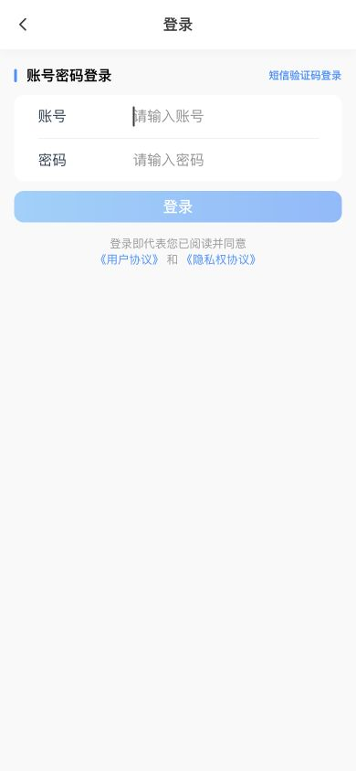
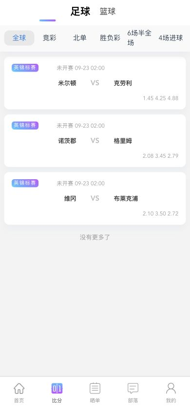
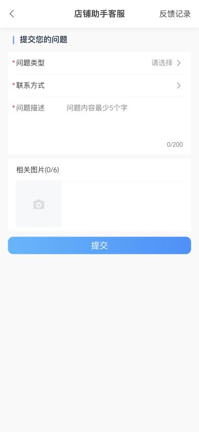
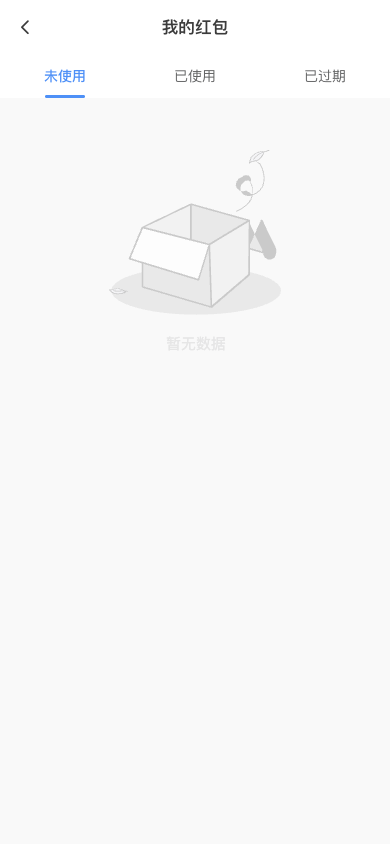
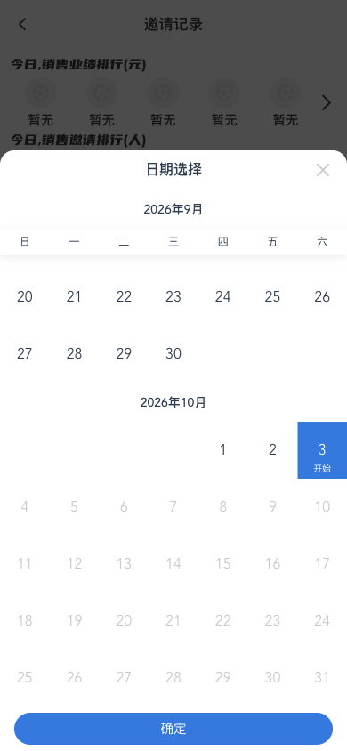

# Lottery Horizon 多端门店协作系统

Lottery Horizon 是一个面向彩票门店日常协作场景的多端项目，包含用户端、手机店主端、PC 店主端和平台运营后台。本仓库用于记录界面、功能范围和临时体验环境，不包含业务源码。

项目交流：[@mayikaiyuan](https://t.me/mayikaiyuan)

## 体验入口

### 用户端

- 访问地址：<https://lottery-horizon-player-temp.xiaomogu-proxy-25a995a0.workers.dev>
- 账号：`19900001003`
- 密码：`HorizonDemo2026!`

### 手机店主端

- 访问地址：<https://lottery-horizon-merchant-mobile-temp.xiaomogu-proxy-25a995a0.workers.dev>
- 账号：`19900001001`
- 密码：`HorizonDemo2026!`

### PC 店主端

- 访问地址：<https://lottery-horizon-merchant-pc-temp.xiaomogu-proxy-25a995a0.workers.dev>
- 账号：`19900001001`
- 密码：`HorizonDemo2026!`

### 平台运营后台

- 访问地址：<https://lottery-horizon-platform-temp.xiaomogu-proxy-25a995a0.workers.dev>
- 账号：`19900001002`
- 密码：`HorizonDemo2026!`

体验环境中的数据会不定期重置，请勿录入真实身份、支付或业务数据。不同账号仅显示其角色可以访问的功能；涉及资金、权限变更和平台配置的操作会受到演示权限限制。

## 用户端界面

图片来自项目实际页面或视觉验收记录。比赛列表由本项目接口读取数据库中的赛事数据，不使用目标站接口；其他画面不使用虚构群成员或聊天内容。

| 账号登录 | 比赛列表 | 问题反馈 |
| --- | --- | --- |
|  |  |  |

| 晒单通知 | 红包记录 | 日期筛选 |
| --- | --- | --- |
|  |  |  |

## 店主端与平台端界面

登录后，导航和操作入口会根据账号所属门店及角色权限展示。

| 手机店主端 | PC 店主端 |
| --- | --- |
|  |  |

## 功能范围

- 用户端：竞彩足球、篮球、北京单场、胜负过关、数字彩、多期追号、跟单、合买、社区、即时比分、直播、钱包、订单和消息。
- 店主端：接单、出票、退款、订单流转、员工权限、门店管理、资金账本、经营统计、设备和打印管理。
- 平台端：商户与门店治理、角色权限、资金审计、开奖数据、内容运营、风控和日志追踪。
- 多端协同：用户、店员、店主和平台管理员按角色隔离，关键操作保留可追踪记录。

更完整的模块说明见 [功能清单](docs/FEATURES.md)。

## 实现概览

项目采用前后端分离架构，覆盖 H5、移动端与桌面管理端。后端按认证、权限、订单、资金、消息、开奖和运营等领域拆分，并配套 PostgreSQL、Redis、对象存储、异步任务与自动化验证。

## 项目索引

相关主题包括彩票店铺助手、彩票门店管理、体彩店主系统、彩票商户后台、彩票出票与订单协同、竞彩足球、数字彩、跟单合买、UniApp 用户端、Vue 管理后台和门店 SaaS。

## 重要说明

本项目仅作软件技术、界面和门店协作流程展示，不提供投注、代购、资金归集、开奖控制、赌博或其他受限制服务，不构成经营许可、投资建议、法律建议或任何交易邀请。严禁将本项目或体验环境用于赌博、诈骗、洗钱、非法集资、侵犯个人信息、绕过监管或其他违法违规活动。

体验环境及其数据、接口、截图和外部链接按现状提供，不保证持续可用、实时、完整或适合特定用途。访问者应自行确认并遵守所在地法律法规、行业规则与许可要求。完整条款见 [免责声明与使用边界](DISCLAIMER.md)。
