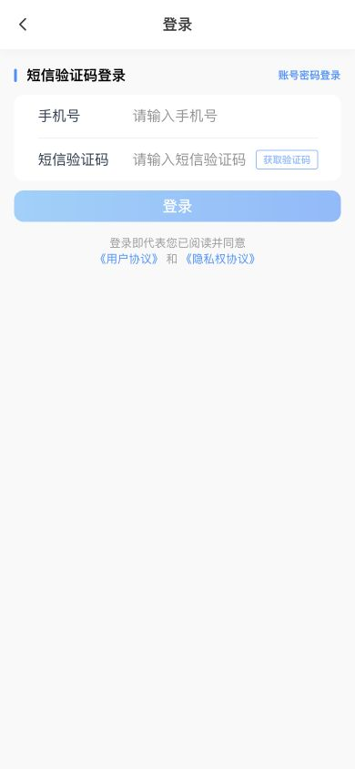
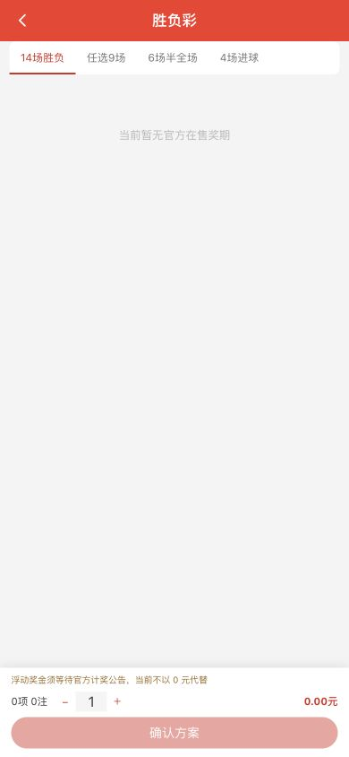
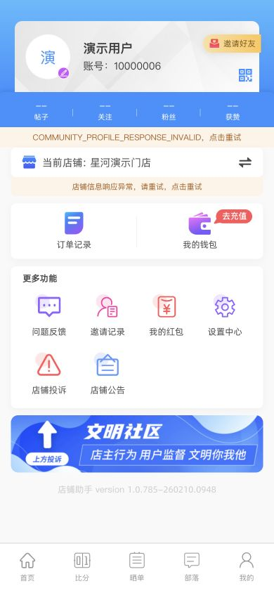
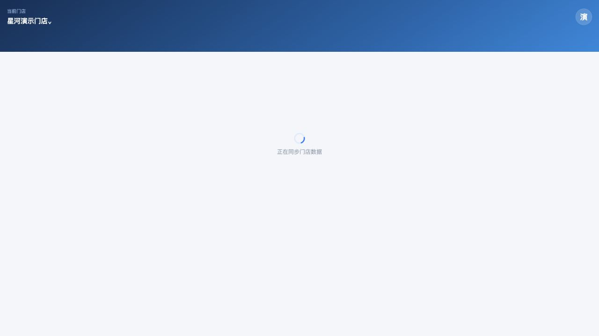
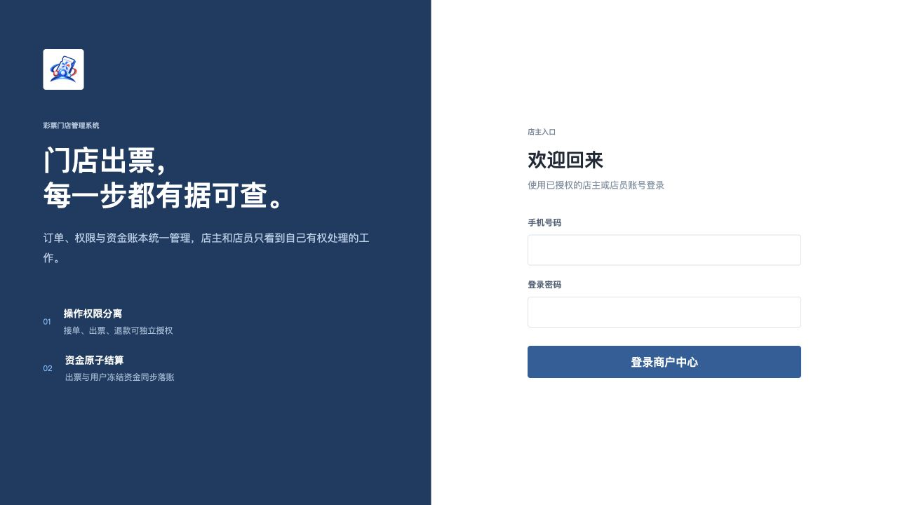
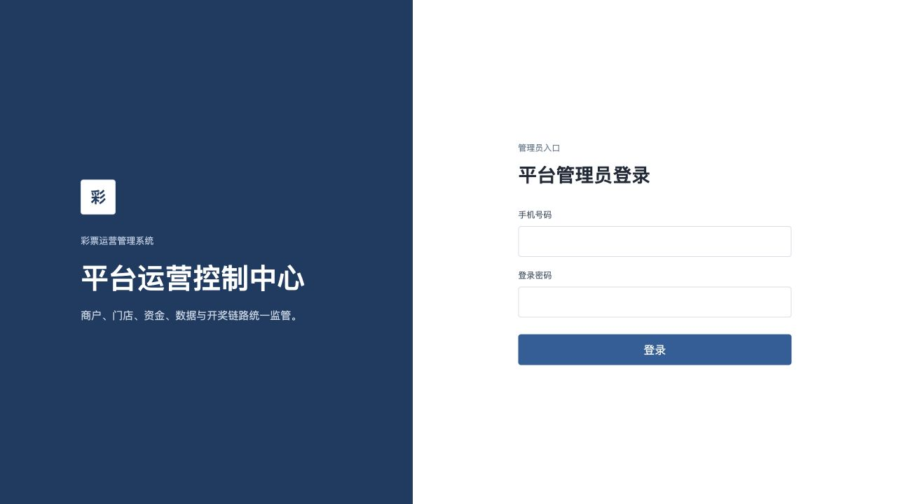

# Lottery Horizon 彩票门店管理系统｜店铺助手与运营后台

> 彩票店铺助手、体彩店主系统、彩票商户后台与平台运营控制台的多端产品演示。

## 在线演示与技术咨询

- **技术咨询（Telegram）：[@mayikaiyuan](https://t.me/mayikaiyuan)**
- **用户端：** https://lottery-horizon-player-temp.xiaomogu-proxy-25a995a0.workers.dev
- **手机店主端：** https://lottery-horizon-merchant-mobile-temp.xiaomogu-proxy-25a995a0.workers.dev
- **PC 店主端：** https://lottery-horizon-merchant-pc-temp.xiaomogu-proxy-25a995a0.workers.dev
- **平台运营后台：** https://lottery-horizon-platform-temp.xiaomogu-proxy-25a995a0.workers.dev

| 演示端 | 演示账号 | 演示密码 |
| --- | --- | --- |
| 用户端 | `19900001003` | `HorizonDemo2026!` |
| 手机店主端 | `19900001001` | `HorizonDemo2026!` |
| PC 店主端 | `19900001001` | `HorizonDemo2026!` |
| 平台运营后台 | `19900001002` | `HorizonDemo2026!` |

演示环境只用于产品体验，数据会不定期重置。请勿录入真实身份、支付或业务数据。临时演示环境正在分批升级 API，个别登录后页面可能出现降级提示；这不代表本展示仓库开放商业源码。

## 产品截图

### 用户端

| 登录 | 传统足彩 14 场 / 任选 9 场 / 6 场 / 4 场 | 登录后的用户中心 |
| --- | --- | --- |
|  |  |  |

### 手机店主端

### PC 店主端

### 平台运营后台

## 核心能力

- 用户端：竞彩足球、篮球、北京单场、胜负过关、数字彩、多期追号、跟单、合买、社区、即时比分、直播、钱包与订单。
- 店主端：接单、出票、退款、订单流转、员工权限、门店管理、资金账本、经营统计、设备与打印管理。
- 平台端：商户和门店治理、角色权限、资金审计、开奖数据、内容运营、风控与日志追踪。
- 多端协同：用户、店员、店主和平台管理员按角色隔离，关键操作保留可追踪记录。

更多说明见 [产品能力清单](docs/FEATURES.md)。

## 技术架构

系统采用现代化前后端分离架构，覆盖 H5、移动端与桌面管理端；后端围绕认证、权限、订单、资金、消息、开奖和运营域进行模块化设计，并配套 PostgreSQL、Redis、对象存储、异步任务与自动化验证。

本仓库是**产品展示仓库，不包含商业源码**。页面截图和演示链接用于介绍产品能力，不代表开放源代码授权。如需技术方案、部署或合作咨询，请联系 Telegram：[@mayikaiyuan](https://t.me/mayikaiyuan)。

## 产品定位与搜索关键词

Lottery Horizon 面向彩票门店数字化协作场景，覆盖彩票店铺助手、彩票门店管理系统、体彩店主系统、彩票商户后台、彩票出票与订单协同、竞彩足球与数字彩展示、跟单合买、彩票运营平台、UniApp 用户端、Vue 店主后台和彩票 SaaS 等产品方向。

## 合规说明

本项目演示的是门店数字化、订单协同和运营管理能力，不提供任何地区的经营许可，也不构成投注、支付或投资建议。实际使用者应自行确认并遵守所在地法律法规、行业规范和许可要求。
